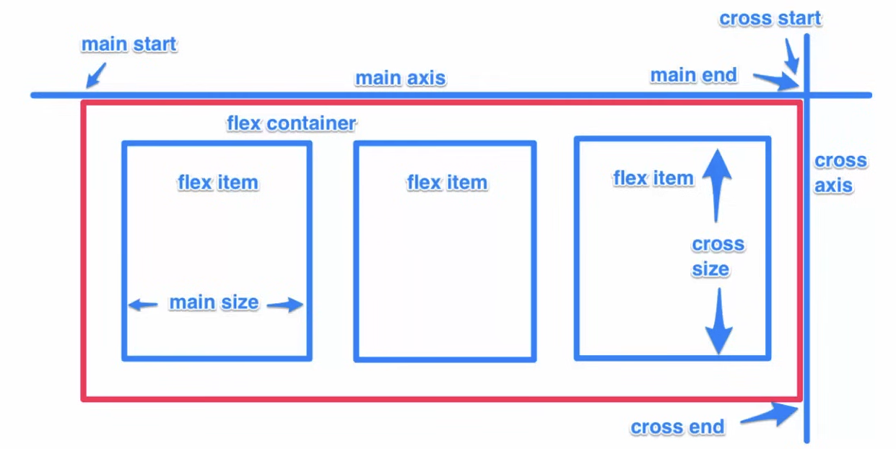

# Flexbot

easy and clean way to arrange items within a container

---

1. No floats
2. Responsive & mobile friendly
3. Positioning child elements is easier
4. Container's margins do not collapse with the margins of contents
5. Order of elements can be changed without editing the HTML

---

 

---

- display
- flex-direction
- flex-wrap
- flex-basis
- justify-content
- align-self
- align-items
- align-content
- flex-grow
- flex-shrink
- flex
- order

---
